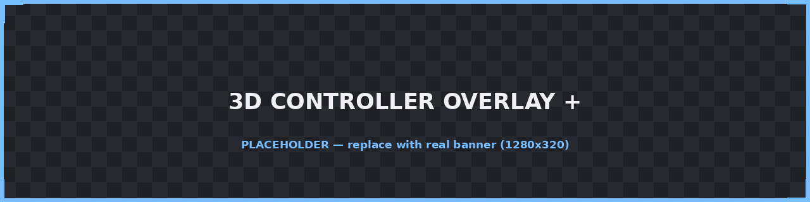
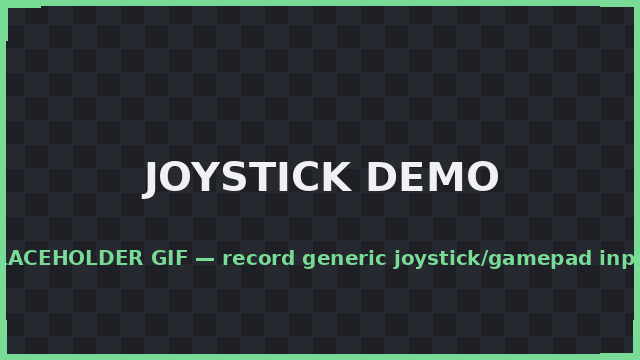
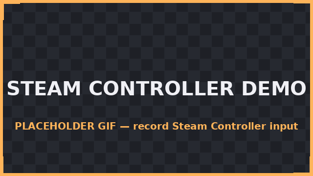
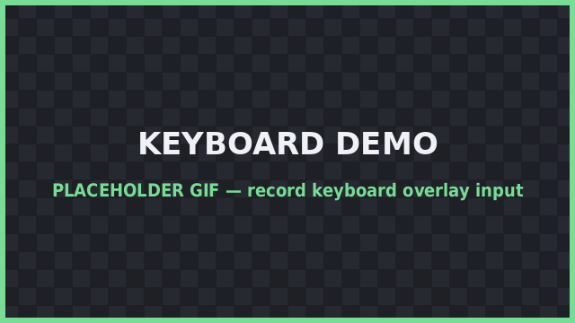
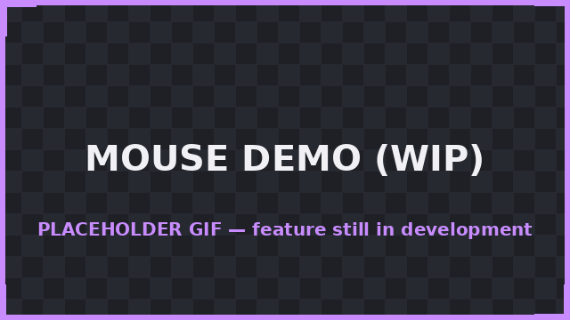

# 3D Controller Overlay +



**3D Controller Overlay +** (`3dco+`) is an AI-assisted continuation of [**3D Controller Overlay**](https://github.com/larfingshnew/3d-controller-overlay) by **Larf** ([larfingshnew](https://github.com/larfingshnew)). It's a lightweight OpenGL/SDL2 program that renders a live 3D model of your controller — buttons, sticks, triggers, touchpads, and gyro/accel — so content creators can show what their input device is doing without a handcam.

This project is a **fork, not a replacement**. It exists as an homage to the original tool and its creator, rebuilt on top of the same rendering foundation but pushed further with the help of AI-assisted coding. All credit for the original concept, models, and engine goes to Larf. If you just want the classic, minimal version, go use [the original repo](https://github.com/larfingshnew/3d-controller-overlay) — it's great on its own.

The `+` in the name is meant literally: **more controllers, more rendering features, more input paths, more build tooling** — while keeping the same "point it at your controller and it just works" spirit.

---

## Table of contents

- [What stayed the same](#what-stayed-the-same)
- [What's new in the `+`](#whats-new-in-the-)
- [How it works](#how-it-works)
- [Supported input](#supported-input)
- [Work in progress / known bugs](#work-in-progress--known-bugs)
- [Building](#building)
- [Credits](#credits)

---

## What stayed the same

- **Core concept**: an OpenGL scene per connected controller, with each button/stick/trigger mapped to its own mesh piece that moves, presses, or lights up in real time.
- **Rendering stack**: GLFW + glad (OpenGL loader) + SDL2 (input) + GLM (math) + Dear ImGui (the settings UI).
- **Model format & library**: controller parts are still individual `.obj` meshes, and the original controller library ships unchanged — DualSense, DualShock 4, Xbox 360, Xbox One, Switch Pro, Joy-Con (left/right/grip), GameCube pad, and the Wavebird.
- **Directional/point/spot lighting system** and the customizable grid floor.
- **Cross-platform target**: Windows, Linux, and macOS.

## What's new in the `+`

Comparing the two codebases side by side, the `+` fork roughly **doubles to triples the size** of the core source files (`controller_window.cpp` ~2.2x, `settings_window.cpp` ~1.9x, `model.cpp` ~2.8x) on top of the original architecture. The concrete additions:

### Rendering & customization
- **Custom model import via Assimp.** You're no longer limited to the built-in controller library — you can import your own mesh (glTF, FBX, and anything else Assimp reads) and map its parts to buttons/axes through a new import-preview/assignment workflow.
- **Pivot-point editing.** Individual mesh pieces can be repositioned by dragging their pivot in the 3D viewport, instead of only editing raw offsets in a settings panel.
- **Per-part material alpha (transparency).**
- **Mouse orbit & zoom** for the camera, plus a dedicated **freelook** mode (independent from the controller-driven camera), with adjustable move/turn/mouse sensitivity.
- **Global and per-button "press" highlight colors**, with original-color tracking so highlighted parts revert correctly.
- **Touch-area visualization**: a drawable wireframe/fill overlay showing the real hit-area of touchpads, useful when lining up custom pads.
- Expanded **touchpad support**: multiple touchpads with 2-finger tracking each (the original supported a single pad; this tracks up to 4 pads × 2 fingers, plus extra touch-point meshes per model).

### Input
- **Raw joystick fallback.** In addition to SDL's `GameController` API (used for recognized/mapped pads), the `+` fork can open a device as a raw `SDL_Joystick`, so unmapped or unusual controllers still produce usable input instead of being ignored.
- **Per-axis/button mapping inversion**, so a stick or trigger that reads backwards on your hardware can be flipped without needing a new SDL mapping.
- **Gyro & accelerometer improvements**: dedicated sensitivity/correction settings, configurable reset-gyro button combo, and optional debug logging of raw sensor data.

### Engineering / tooling
- **Logging via spdlog**, including rotating log files — the original had no structured logging.
- **CMake-based build system** (`CMakeLists.txt`) replacing the original's platform-specific shell/batch scripts, plus convenience scripts (`build-all.sh`, `build-appimage.sh`, `build-macos.sh`, `build-windows.sh`) and Docker-based cross-build files (`Dockerfile.appimage`, `Dockerfile.macos`, `Dockerfile.windows`) for reproducible builds/packaging.
- **AppImage & `.desktop` integration** on Linux (`3dco.desktop.in`) for proper application-menu installation.
- New dependencies pulled in to support the above: **Assimp** (model import) and **spdlog/fmt** (logging), alongside the original GLFW/SDL2/GLM/stb stack.

## How it works

At a high level, the pipeline is unchanged from the original:

1. **SDL2** enumerates connected controllers/joysticks and streams button, axis, hat, touchpad, and sensor (gyro/accel) events.
2. Each connected device gets its own **GLFW window** and OpenGL context (`controller_window`), rendering a 3D scene built from that controller's `.obj` parts.
3. Every frame, input state is mapped onto the corresponding mesh: buttons translate along their press axis and/or change color, sticks and triggers rotate/translate proportionally to their live analog value, and touchpad finger positions move small touch-point meshes across the pad mesh.
4. **Dear ImGui** drives the settings window — lighting, camera, colors, mappings, model import/mapping, and window behavior (always-on-top, borderless, click-through/drag-to-move, background color/alpha for green-screen or transparent capture).
5. In the `+` fork, the same pipeline now also accepts **raw joystick input** (for devices SDL doesn't have a built-in mapping for) and **imported custom meshes** (via Assimp) instead of only the bundled `.obj` library, with an added pivot/highlight/touch-area layer for fine-tuning how everything looks on stream.

## Supported input

| Input type | Status |
|---|---|
| Standard gamepads (Xbox, DualShock/DualSense, Switch Pro, Joy-Con, GameCube, etc.) | ✅ Supported (via SDL GameController) |
| Unmapped/generic joysticks | ✅ Supported (via raw SDL Joystick fallback) |
| Gyro / accelerometer | ✅ Supported, with sensitivity/correction tuning |
| Touchpads (DualShock/DualSense) | ✅ Supported, multi-touch, multiple pads |
| Steam Controller | 🚧 Work in progress |
| Keyboard overlay | 🚧 Work in progress |
| Mouse overlay | 🚧 Work in progress |
| Racing wheel | 🚧 Work in progress |






> All four GIFs above are placeholders — drop in your own recordings (`images/joystick_placeholder.gif`, `images/steamcontroller_placeholder.gif`, `images/keyboard_placeholder.gif`, `images/mouse_placeholder.gif`) or rename the files and update the links.

## Work in progress / known bugs

- **Keyboard support** — planned overlay for showing live keypresses; not implemented yet.
- **Mouse support** — planned overlay for cursor movement/clicks/scroll; not implemented yet.
- **Steam Controller** — not yet in the bundled model library or input path; planned.
- **Racing wheel support** — planned for pedal/wheel/force-feedback devices.
- General stability/edge-case bugs from the expanded input and import paths are still being ironed out — expect rough edges while these land. Please file issues with repro steps if you hit one.

## Building

This fork builds with **CMake** instead of the original's per-platform scripts. From the repo root:

```
 rm -rf build
  mkdir build && cd build
  cmake ..
  make -j$(nproc);
```

The resulting executable is **`3dco+`**.

**Dependencies** (via your system package manager / pkg-config): `glfw3`, `sdl2`, `assimp`, `spdlog`, `fmt`, plus OpenGL and a C++17 compiler. On Linux, `libsdl2-dev`, `libglfw3-dev`, `libassimp-dev`, and `libspdlog-dev` (naming varies by distro) cover it.

Convenience scripts (`build-all.sh`, `build-appimage.sh`, `build-macos.sh`, `build-windows.sh`) and Docker cross-build files are included for packaged/AppImage builds, but the snippet above is the day-to-day build.

## Credits

- **Original creator & engine**: [Larf](https://github.com/larfingshnew) — [3D Controller Overlay](https://github.com/larfingshnew/3d-controller-overlay). Please go star/support the original.
- **This fork**: maintained as a homage/continuation, extended with AI-assisted coding for the features listed above.
- Third-party libraries: GLFW, glad, SDL2, GLM, Dear ImGui, stb_image, Assimp, spdlog/fmt.
